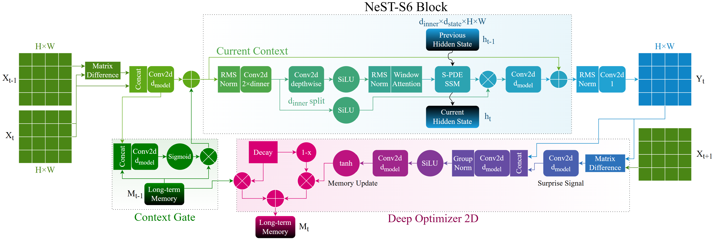

# NeST-S6: Nested Convolutional Spatiotemporal (PDE-aware) State-space Model for 5G Network Traffic Forecasting

NeST-S6 (“Nest S 6”) is a **nested-learning spatiotemporal forecasting model** designed for **grid-based cellular traffic prediction**.
It integrates a **fast per-step spatiotemporal predictor** (convolution + windowed 2D attention + **PDE-aware selective state-space updates**) with a **slow persistent memory** updated by a learned **Deep Optimizer**.

<p align="center">
  
</p>

---

## Key Features

- **Nested Learning Memory**: A slow, persistent spatial memory improves robustness under **global/dynamic drift**.
- **PDE-aware SSM Core**: Spatially-varying selective state-space updates with stable exponential discretization.
- **Local Mixing + Windowed Attention**: Depthwise convolution and windowed attention for efficient 2D context.
- **End-to-end Grid Forecasting**: Predict full spatial kernels/patches at once (instead of scalar-per-pixel).
- **Autoregressive Rollout**: Built-in multi-step forecasting via recursive prediction.

---

## Problem Formulation (Kernel / Patch Forecasting)

Let $M = \{M_1, M_2, \ldots, M_T\}$ be a sequence of traffic grids where each $M_t \in \mathbb{R}^{H \times W}$.
For each spatial position $(i, j)$, we extract a spatiotemporal input kernel:

$$
X^{(i,j)} \in \mathbb{R}^{T \times K \times K}
$$

The goal is to predict the **future spatial kernel** at the next time step:

$$
Y^{(i,j)} = M_{t+1}[i-r : i+r,\; j-r : j+r] \in \mathbb{R}^{K \times K},
\quad r=(K-1)/2
$$

We learn parameters $\theta$ by minimizing a forecasting loss:

$$
\min_{\theta} \; L\big(f_{\theta}(X^{(i,j)}),\, Y^{(i,j)}\big)
$$

---

## Model Architecture

### 1. Fast Learner (per-step spatiotemporal dynamics)

At each step $t$, NeST-S6 builds a 2-channel input from the current frame and its temporal difference:

$$
\mathbf{u}_t = \text{concat}(\mathbf{x}_t,\, \mathbf{x}_t - \mathbf{x}_{t-1})
$$

This is projected into a latent context and processed by a stack of NeST-S6 blocks combining:

- **Depthwise convolution + SiLU**
- **Windowed 2D attention**
- **Spatial PDE-aware selective state-space update** (per-pixel state with dynamic low-rank parameters)

### 2. Slow Learner (persistent memory + Deep Optimizer)

NeST-S6 maintains a long-term spatial memory $\mathbf{M}_t$ updated by a learned optimizer.
A **surprise signal** (prediction error projected into latent space) drives memory writes; otherwise memory decays smoothly.

### 3. Memory Injection (context gate)

Long-term memory is fused back into the fast context via a learned gate, enabling drift-resilient forecasting.

---

## Installation

### 1. Clone and install locally

```bash
git clone git@github.com:ZineddineBtc/NeST-S6.git
cd NeST-S6
pip install -e .
```

### 2. Dependencies

- Python 3.10
- PyTorch==2.6.0

---

## Usage

### Example: Quick test (forward + rollout)

```python
import torch
from nest_s6 import NeST_S6

# Input tensor: (B, T, H, W)
B, T, H, W = 2, 6, 20, 20
x = torch.randn(B, T, H, W)

model = NeST_S6(n_layers=2, d_model=48, d_state=8, d_conv=3, expand=2, attn_window=8, a_mod_rank=2)

with torch.no_grad():
    # last-frame prediction: (B, H, W)
    y_last = model(x)
    print("Last prediction:", y_last.shape)

    # full sequence prediction: (B, T, H, W)
    y_seq = model(x, return_sequence=True)
    print("Sequence prediction:", y_seq.shape)

    # autoregressive rollout (+2): (B, T+2, H, W)
    y_roll = model(x, steps_to_predict=2, return_sequence=True)
    print("Rollout prediction:", y_roll.shape)
```

---

## Citation

If you use NeST-S6 in your research, please cite the (pending-review) paper and/or the repository:

```bibtex

@software{Bettouche2026NeSTS6Repo,
  title  = {NeST-S6 (Reference Implementation)},
  author = {Bettouche, Zineddine and Ali, Khalid and Fischer, Andreas and Kassler, Andreas},
  year   = {2026},
  url    = {https://github.com/ZineddineBtc/NeST-S6},
}
```

---


## Repository Structure

```
NeST-S6/
├── nest_s6/
│   ├── __init__.py          # Exports NeST_S6
│   ├── model.py             # Core NeST-S6 architecture
│   ├── __version__.py
├── nests6-arch.png
├── pyproject.toml
├── README.md
```

